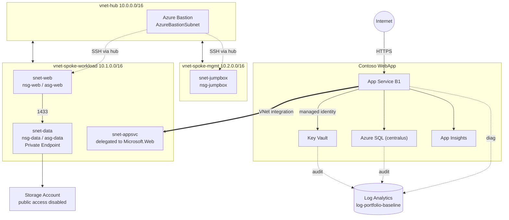
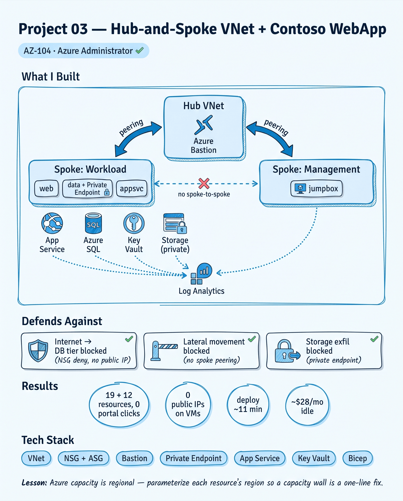

# Project 03 — Hub-and-Spoke VNet + Contoso WebApp

> **Microsoft Cybersecurity Architect Portfolio** · Project 03 of 9
> Paired cert: **AZ-104 Microsoft Azure Administrator** · ✅ Passed 2026-06-18 ([verify](https://learn.microsoft.com/en-us/users/KhayamKhan-6558/credentials/240E634A327E33AE))
> Shipped: 2026-06-20
> By **Khayam Khan** · SOC Analyst → Cloud Security Architect · 🇵🇭 Philippines · [LinkedIn](https://www.linkedin.com/in/khankhayamk/)

---

## 1. What I Built

A hub-and-spoke network on Azure with one hub and two spokes, plus a two-tier web workload deployed into it. Everything is defined in modular Bicep and deployed from the CLI.

The hub holds Azure Bastion. The spokes hold the workload (web, data, and an App Service subnet) and a management jumpbox. Traffic between spokes has to pass through the hub, because the spokes are only peered to the hub and never to each other. Each VM subnet uses a deny-by-default NSG with a few scoped allow rules. A storage account sits behind a private endpoint with its public access turned off. On top of that network, the "Contoso WebApp" workload runs an App Service that reads its SQL connection string from Key Vault using a managed identity, with diagnostics from the app, the database, and Key Vault all flowing to the Project 01 Log Analytics workspace.

This workload is meant to stay. Projects 04 through 07 harden it: Azure Firewall and a WAF, a private endpoint for SQL, Sentinel detections, and Purview classification.

---

## 2. Problem Solved

**Problem:** A flat network with public IPs on everything is the default way people stand up their first Azure workload, and it is also the easiest one to attack. There is no segmentation, lateral movement is free, management ports face the internet, and databases sit one misconfigured firewall rule away from being public.

**Who hurts:** Anyone moving past a single VM. Small teams shipping their first real app, and larger orgs that let a sandbox grow into something production-shaped without a network design underneath it.

**Why it matters:** Hub-and-spoke is the reference topology Microsoft expects you to know for AZ-104 and AZ-500, and it is the shape almost every Azure landing zone takes. Building it once, with a real workload behind it, gives the rest of this portfolio something concrete to defend instead of a diagram.

---

## 3. Technologies Used (and Why)

| Technology | Why I chose it | Alternative considered |
|---|---|---|
| VNet + hub-and-spoke peering | Isolates each spoke and forces inter-spoke traffic through the hub, where a firewall lands in P04 | Single flat VNet (no isolation); full mesh peering (no central inspection point) |
| NSGs + Application Security Groups | Deny-by-default with rules written against roles (`asg-web` → `asg-data` on 1433) instead of IPs | IP-based NSG rules (break when addresses change) |
| Azure Bastion (Standard) | SSH/RDP to VMs with no public IPs; Standard adds native client and file transfer | Public IP + just-in-time access (still exposes the port); self-hosted jump VM (more to patch) |
| Private Endpoint + Private DNS | Takes the storage account off the public internet and resolves it to a private IP inside the VNet | Service endpoints (still a public IP, weaker than a private endpoint) |
| App Service with regional VNet integration | Runs the web tier as PaaS while still reaching private resources in the spoke | VM-hosted web app (more to manage and patch) |
| Key Vault + managed identity | Holds the SQL connection string so it never appears in code or app settings | Connection string in app settings (plaintext secret) |
| Application Insights + Log Analytics | Reuses the Project 01 workspace, which becomes the Sentinel workspace in P05 | Per-app standalone monitoring (splits telemetry across silos) |
| Bicep (modular) | Reproducible and reviewable; the whole network rebuilds from one command | Portal click-ops (not reproducible); Terraform (deferred to post-AZ-500) |

---

## 4. Architecture Diagram



A NotebookLM infographic (Azure Blue, sketch-note style) gives the recruiter-facing one-image summary:



Full address plan is in [`network-plan.md`](network-plan.md); the topology and segmentation table are in [`architecture/diagram.md`](architecture/diagram.md).

---

## 5. Trade-offs & Decisions

### What I chose not to do (and why)

| Skipped | Why |
|---|---|
| Spoke-to-spoke peering | Leaving it out forces inter-spoke traffic through the hub, which is where Azure Firewall inspects it in Project 04. |
| Azure Firewall in the hub | The `snet-shared` subnet is reserved for it, but the firewall itself is an AZ-500 / Project 04 control. Adding it here would pre-empt that project. |
| SQL private endpoint | SQL is deliberately left public in this project so Project 04 can show the before/after of locking it down. |
| WAF in front of the App Service | Same reason. The app is public by design at P03; the WAF is a P04 control. |

### What I would do differently

- Deploy the test VMs and run live segmentation traffic. They are gated behind a `deployTestVms` flag because the subscription has no Bpsv2 compute quota in East US yet. The segmentation is verified from config instead (Section 8).
- Keep SQL in the same region as the app. It is in `centralus` only because East US had no capacity for new SQL servers during the build.

### Known limitations

- SQL is in a different region than the rest of the workload, which adds cross-region latency on the app-to-database hop. Acceptable for a lab; worth revisiting if this were real.
- Segmentation is proven from the deployed NSG rules and peering, not from live packet tests, until the compute quota lands.

---

## 6. Threat Model / Security Scope

### In scope

- Lateral movement between spokes (no spoke-to-spoke peering).
- Direct internet access to the data tier (NSG deny plus no public IP).
- Public exposure of the storage account (private endpoint, public access disabled).
- Brute force against the management jumpbox (Bastion-only, no inbound rules).
- Hardcoded database credentials (connection string in Key Vault, read by managed identity).

### Out of scope (handled later)

| Out of scope | Why | Addressed in |
|---|---|---|
| Layer 7 web attacks on the App Service | No WAF yet; app is public by design | Project 04 |
| Public SQL exposure | Private endpoint deferred for the before/after | Project 04 |
| Detection and alerting on the telemetry | No analytic rules yet | Project 05 |
| Data classification | No labels or DLP yet | Project 07 |

### MITRE ATT&CK techniques covered

| Technique | ID | Control in this project |
|---|---|---|
| Exploit Public-Facing Application | T1190 | Data tier has no public IP; NSG denies non-web inbound |
| Remote Services (lateral movement) | T1021 | No spoke-to-spoke peering, so there is no path between workload and management |
| Exfiltration to Cloud Storage | T1567.002 | Storage account public access disabled; reachable only via private endpoint |
| Brute Force | T1110 | Jumpbox has no inbound rules; access is Bastion-only |
| Unsecured Credentials | T1552 | SQL connection string lives in Key Vault, not in code or app settings |

### Attack Scenarios

| Attack | What stops it here | Upgraded in |
|---|---|---|
| Attacker scans for the database directly from the internet | No public IP on the data tier; `nsg-data` denies all inbound except 1433 from `asg-web` | P04: private endpoint removes SQL from the internet |
| Attacker lands on the jumpbox and pivots to the workload | Management and workload spokes are not peered, so there is no route | P04: Azure Firewall inspects any hub-routed traffic |
| Attacker tries to read the storage account from outside | Public access is disabled; the account only answers on its private endpoint | — |
| Attacker pulls the DB connection string from the app config | It is not there; it is a Key Vault reference resolved by the app's managed identity | P06: identity replaces the stored secret |

---

## 7. Proof It Works

Nine screenshots in `screenshots/`, captured during the build.

| # | File | Shows |
|---|---|---|
| 01 | `01-whatif-19-creates.png` | `what-if` dry run, 19 resources, all create |
| 02 | `02-deployed-resources.png` | Network deployed, every resource succeeded |
| 03 | `03-workload-deploy-succeeded.png` | Workload deployment succeeded |
| 04 | `04-workload-resources.png` | Workload resources, app tier in eastus, SQL in centralus |
| 05 | `05-appservice-live.png` | App Service reachable, HTTP 200 |
| 06 | `06-keyvault-reference-resolved.png` | Key Vault reference resolved by the managed identity |
| 07 | `07-keyvault-audit-logs.png` | Key Vault `SecretGet` audit events in Log Analytics |
| 08 | `08-nsg-rules.png` | `nsg-data`: allow 1433 from web, Bastion-only 22, deny-all at 4096 |
| 09 | `09-no-spoke-peering.png` | Workload spoke peers only to the hub, never to the mgmt spoke |

Screenshots 08 and 09 are the segmentation proof from deployed config. The live VM traffic tests (Bastion to VM, web to data allow, web to data deny, cross-spoke deny) are written up in [`tests.md`](tests.md) and run once the compute quota lands.

---

## 8. Quantified Results

- 19 network resources plus 12 workload resources, deployed with zero portal clicks.
- 3 NSGs, each deny-by-default at priority 4096, with 2 ASGs for role-based rules.
- 0 public IPs on any VM; the only public entry points are the App Service and Bastion.
- Network deploy ~11 minutes (Bastion is the long pole); workload deploy ~3 minutes.
- Full network rebuilds from Bicep in ~8 minutes after teardown.
- ~$28/month idle with Bastion deleted and VMs deallocated.

---

## 9. How to Reproduce

### Prerequisites

- Azure subscription with Owner on a resource group, plus the Project 01 baseline (the `log-portfolio-baseline` Log Analytics workspace).
- Azure CLI ≥ 2.50 with the Bicep extension.
- Two strong passwords exported as environment variables (never committed).

### Deploy

```bash
# Network (rebuildable)
az group create -n rg-network-lab -l eastus
export VM_ADMIN_PASSWORD='<strong-pw>'
az deployment group create -g rg-network-lab --parameters infra/network.bicepparam

# Workload (persistent)
az group create -n rg-contoso-webapp -l eastus
export SQL_ADMIN_PASSWORD='<strong-pw>'
az deployment group create -g rg-contoso-webapp --parameters infra/workload.bicepparam
```

Module layout and parameter notes are in [`infra/README.md`](infra/README.md).

### Teardown

Delete Bastion and deallocate VMs between sessions to stop the meter. The workload resource group is meant to persist for Projects 04 to 07.

---

## 10. Cost to Run

| Resource | Between sessions | Cost if left running |
|---|---|---|
| Azure Bastion | Delete | ~$137/mo |
| Test VMs | Deallocate | ~$0 deallocated |
| App Service (B1) | Keep | ~$13/mo |
| Azure SQL (Basic) | Keep | ~$5/mo |
| Storage, private endpoint, App Insights | Keep | ~$8/mo |
| VNets, NSGs, peering | Keep | Free |

The Project 01 budget alert at $5 still covers this subscription.

---

## 11. Cert Mapping

**AZ-104 Microsoft Azure Administrator**, passed 2026-06-18 (score 841).

| AZ-104 domain | How this project demonstrates it |
|---|---|
| Configure and manage virtual networking | VNets, subnets, hub-and-spoke peering, NSGs and ASGs, Bastion, private endpoints and private DNS |
| Deploy and manage Azure compute resources | App Service plan and app, VNet integration, VM modules (gated on quota) |
| Implement and manage storage | Storage account with private endpoint and public access disabled |
| Monitor and maintain Azure resources | Diagnostic settings from app, SQL, and Key Vault to Log Analytics |

The Log Analytics workspace and tag governance reused here come from Project 01 and carry forward into the AZ-500, SC-200, and SC-300 projects.

---

## 12. Troubleshooting & Lessons Learned

Five non-trivial problems from this build, with the root cause and the fix.

| Symptom | Root cause | Fix | Lesson |
|---|---|---|---|
| Workload deploy failed at preflight; App Service plan B1 rejected with "Total VMs" quota 0. Waited 12 hours, still 0. | A fresh pay-as-you-go subscription ships with 0 App Service compute quota in some regions, and the Quotas blade shows App Service quota as informational with no way to raise it there. | Opened a free quota support ticket (Service and subscription limits → Function or Web App (Windows and Linux) → East US → new limit 3). Approved, deploy succeeded. | "Total VMs: 0" on App Service is not a warm-up delay. If the Quotas blade won't let you request it, file a quota support ticket instead of waiting. |
| SQL server create failed in both eastus and eastus2 with `RegionDoesNotAllowProvisioning`. | Regional capacity restriction for new SQL servers in the East US geo at the time. Not quota, not permissions. | Made the SQL region a parameter (`sqlLocation`) and deployed the database tier to `centralus` while the app stayed in eastus. | Capacity is regional and transient. Parameterize region per resource type so a capacity wall is a one-line change, not a redesign. |
| After switching `sqlLocation` to centralus, the redeploy failed with `InvalidResourceLocation`; the East US SQL server still showed as existing. | A SQL server whose creation fails still registers a resource in the original region and conflicts with the same logical server name elsewhere. | `az sql server delete` the stuck server, confirmed the server list was empty, then redeployed. | A failed create can leave a half-registered resource. Confirm it is actually gone before retrying in another region. |
| The original plan put the App Service in `snet-web` next to a VM, and VNet integration would not deploy. | App Service regional VNet integration needs a subnet delegated to `Microsoft.Web`, and a delegated subnet cannot also host VMs. | Added a dedicated `snet-appsvc` delegated to `Microsoft.Web` and moved integration there. | Plan a separate delegated subnet for App Service from the start. It cannot share with the web-tier VMs. |
| Returning subnet IDs from the VNet module by indexing `vnet.properties.subnets[i].id` failed in a loop (BCP182). | Subnet IDs read off the deployed resource are runtime values and cannot build a compile-time output array. | Built the output with `toObject(subnets, s => s.name, s => resourceId('Microsoft.Network/virtualNetworks/subnets', name, s.name))` so the IDs are deterministic. | When a module hands back child-resource IDs, construct them with `resourceId()` instead of reading them off the resource. |

---

## 13. Tags

`#azure` `#azure-security` `#bicep` `#iac` `#hub-and-spoke` `#vnet` `#nsg` `#azure-bastion` `#private-endpoint` `#app-service` `#key-vault` `#az-104` `#cloud-security` `#soc-analyst` `#microsoft-cybersecurity-architect`

---

## Project metadata

| Field | Value |
|---|---|
| Status | ✅ Shipped 2026-06-20 |
| Effort | ~2 days (build + capacity troubleshooting) |
| Cost to build | $0 (within Free Tier credits) |
| Cost to maintain | ~$28/month (Bastion deleted, VMs deallocated) |
| Next project | Project 04 — Azure Security Hardening (AZ-500) |

---

*This is Project 03 of the [Microsoft Cybersecurity Architect Portfolio](https://github.com/khayamkkhan?tab=repositories) — 9 hands-on Azure projects mapped to 9 Microsoft certs, from AZ-900 through SC-100.*

---

> ### A note on this README
>
> This README was drafted with AI assistance (Claude) for prose polish, formatting consistency, and section structure. The technical work behind it — every VNet subnetted, every Bicep module composed, every NSG rule justified, every workload tier deployed, every screenshot captured — was done by me. Disclosing AI assistance in documentation is the right default for transparency, and it should be the norm rather than the exception.
